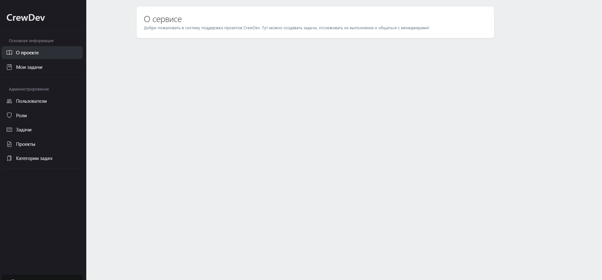
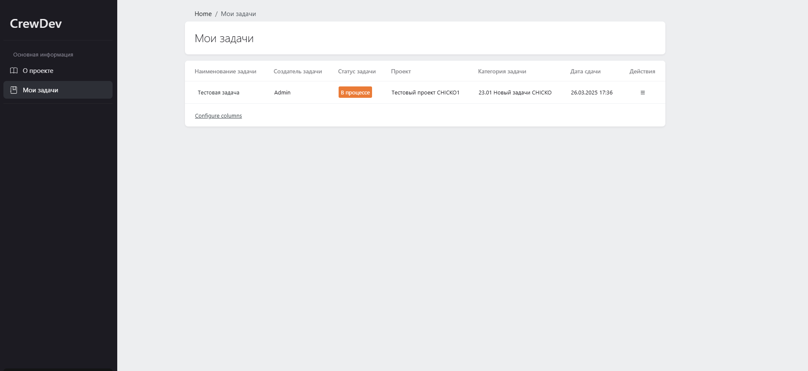

# Менеджер задач для вашего бизнеса

Менеджер задач — это удобный и эффективный инструмент для управления задачами в вашем бизнесе. Он помогает организовать рабочие процессы, улучшить командную работу и следить за выполнением проектов и задач. С помощью этого приложения вы сможете легко назначать задачи, отслеживать их статус, управлять дедлайнами и многое другое.

## Описание

Наш проект представляет собой систему управления задачами, которая позволяет:

- Создавать, редактировать и удалять задачи.
- Назначать исполнителей и отслеживать статус выполнения задач.
- Устанавливать дедлайны и приоритеты для каждой задачи.
- Организовывать задачи по категориям и проектам.
- Просматривать подробную информацию о каждой задаче.
- Легко находить нужную задачу с помощью фильтров и поиска.

С помощью нашего менеджера задач вы сможете эффективно управлять задачами своей команды и улучшить продуктивность работы.

## Особенности

- **Интуитивно понятный интерфейс**: простота использования и удобное взаимодействие.
- **Поддержка командной работы**: возможность добавления нескольких исполнителей на одну задачу.
- **Управление проектами**: разделение задач по проектам для лучшей организации.
- **Дедлайны и приоритеты**: возможность устанавливать сроки выполнения задач и их приоритеты.
- **История изменений**: отслеживайте, кто и когда изменял задачу.
- **Гибкая настройка**: настройка уведомлений и фильтров для удобства работы.

## Скриншоты

### Главная страница



### Страница мои задачи



## Установка

### Требования

- PHP >= 8.43
- Laravel >= 12
- MySQL или PostgreSQL
- Composer

### Шаги по установке

1. Клонируйте репозиторий:

   ```bash
   git clone https://github.com/DJamMix/task_manager_larvit.git
   cd ваш-репозиторий