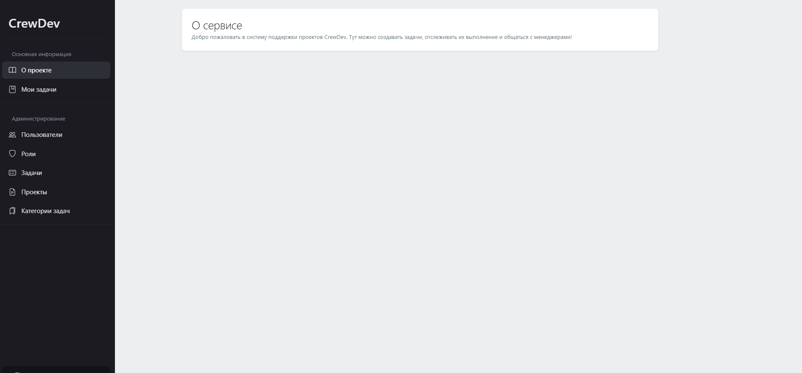
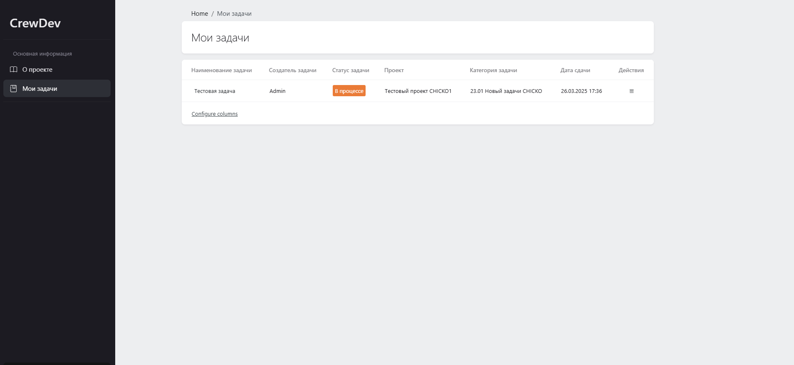

# TaskManagerLarVit

Система поддержки проектов и управления задачами для команд разработки, агентств и заказчиков.

Построена на **Laravel 12** и **Orchid Platform**: единая веб-панель (`/admin`) для сотрудников и клиентов, со встроенным мессенджером, уведомлениями, учётом времени и актами.

Репозиторий публичный — можно клонировать, разворачивать у себя и адаптировать под свои процессы.

---

## Возможности

### Задачи и проекты
- Проекты, категории и очереди задач (например `PHP`, `FRONTEND`, `DEVOPS`)
- Полный жизненный цикл статусов: черновик → согласование → оценка → в работе → тесты (stage/prod) → демо → оплата → завершено / отмена
- Приоритеты P0–P5, типы задач (обычная / баг)
- Назначение исполнителей, связи между задачами (связь, блокирует, родитель / подзадача)
- Комментарии, вложения, учёт времени
- Фильтры и поиск (Laravel Scout + Meilisearch — опционально)
- Контекст активного проекта (переключатель в интерфейсе)

### Роли и доступы
| Роль | Для кого | Что доступно |
|------|----------|--------------|
| **Администратор** | Владелец системы | Всё: пользователи, роли, задачи, проекты, акты, чаты |
| **PM / Менеджер** | Ведение проектов | Задачи, проекты, категории, акты, пользователи, чаты |
| **Сотрудник** | Исполнители | Мои задачи, входящие, время, чаты, вложения |
| **Клиент / Заказчик** | Представители заказчика | Свои проекты и задачи, чаты с командой |
| **Контакт клиента** | Наблюдатели | Чаты + задачи, где добавлен наблюдателем |

### Мессенджер
- Личные и групповые чаты
- Ответы, пересылка, упоминания, прикрепление задач
- Файлы и голосовые сообщения
- Выделение сообщений: пересылка и удаление (у себя / у всех)
- Закрепление чатов, mute, поиск по истории
- Индикаторы набора текста, непрочитанные, опрос обновлений

### Звонки (LiveKit)
- Групповые аудио/видеозвонки из чата
- Гостевая ссылка без входа в систему: `/call/guest/{token}`

### Уведомления
- Колокольчик Orchid в панели
- **Web Push** в браузер (VAPID), в том числе когда вкладка закрыта
- Привязка Telegram-аккаунта к профилю (бот + webhook)

### Акты
- Создание и редактирование актов
- Выгрузка в Word

### Дашборд
- Аналитика после входа: сводка по задачам и активности команды

---

## Скриншоты

### Главная (аналитика)



### Мои задачи



---

## Стек

| Компонент | Версия / технология |
|-----------|---------------------|
| PHP | ^8.2 |
| Backend | Laravel 12 |
| Админ-UI | Orchid Platform 14 |
| БД | SQLite (из коробки) / MySQL / PostgreSQL |
| Очереди / кэш / сессии | database (по умолчанию) или Redis |
| Поиск | Laravel Scout → Meilisearch (опционально) |
| Push | Web Push (VAPID) |
| Звонки | LiveKit (Docker) |
| Frontend-сборка | Vite 6, Tailwind 4 |

Основной интерфейс — Blade-экраны Orchid и статические ассеты в `public/`. Отдельного SPA нет.

---

## Как пользоваться

1. Откройте `{APP_URL}/admin` и войдите.
2. После входа откроется **аналитика** (`/admin/welcome`).
3. Дальше по ролям:
   - **Сотрудник:** «Мои задачи», «Входящие», «Чаты», учёт времени на карточке задачи.
   - **PM / админ:** «Задачи», «Проекты», «Категории», «Очереди», «Акты», «Пользователи».
   - **Клиент:** раздел проектов и задач заказчика + чаты.
4. Чаты: `/admin/chats` — создание ЛС/групп, файлы, голос, звонки, пересылка и удаление сообщений (зажать сообщение на десктопе или мобиле).
5. Профиль: `/admin/profile` — привязка Telegram, настройки.

Префикс панели меняется через `PLATFORM_PREFIX` (по умолчанию `/admin`).

---

## Требования

### Обязательно
- PHP **8.2+** с расширениями: `mbstring`, `openssl`, `pdo`, `tokenizer`, `xml`, `ctype`, `json`, `fileinfo`, `curl`
- [Composer](https://getcomposer.org/)
- Node.js 18+ и npm (сборка фронта)
- БД: SQLite **или** MySQL 8+ / PostgreSQL 13+

### Рекомендуется для продакшена
- HTTPS (нужен для Web Push и безопасных звонков)
- Процесс очередей (`queue:work` / Supervisor)
- Достаточный `upload_max_filesize` / `post_max_size` (например 16M+) для голоса и файлов

### Опционально
- Docker — для LiveKit
- Meilisearch — полнотекстовый поиск по задачам
- Redis — кэш/очереди/сессии
- Telegram Bot Token — привязка аккаунтов

---

## Быстрый старт (локально)

```bash
git clone https://github.com/DJamMix/task_manager_larvit.git
cd task_manager_larvit

composer install
cp .env.example .env
php artisan key:generate

# SQLite (проще всего для первого запуска)
touch database/database.sqlite

php artisan migrate
php artisan db:seed
php artisan storage:link

# Администратор Orchid
php artisan orchid:admin

npm install
npm run build
```

Запуск всего сразу (сервер + очередь + логи + Vite):

```bash
composer run dev
```

Или по отдельности:

```bash
php artisan serve
php artisan queue:listen --tries=1
npm run dev
```

Панель: [http://127.0.0.1:8000/admin](http://127.0.0.1:8000/admin)

---

## База данных

### SQLite (по умолчанию в `.env.example`)

```env
DB_CONNECTION=sqlite
# файл: database/database.sqlite
```

### MySQL

```env
DB_CONNECTION=mysql
DB_HOST=127.0.0.1
DB_PORT=3306
DB_DATABASE=task_manager
DB_USERNAME=root
DB_PASSWORD=secret
```

### PostgreSQL

```env
DB_CONNECTION=pgsql
DB_HOST=127.0.0.1
DB_PORT=5432
DB_DATABASE=task_manager
DB_USERNAME=postgres
DB_PASSWORD=secret
```

После смены БД:

```bash
php artisan migrate --force
php artisan db:seed --force
php artisan orchid:admin
```

Сидер создаёт роли из `RoleCatalog` (`admin`, `pm`, `manager`, `employee`, `client`, `client_employer`, `client_contact`). Пользователей не затирает.

---

## Развёртывание на сервере

Ниже типовой сценарий для Linux (Debian/Ubuntu) + Nginx + PHP-FPM. Пути подставьте свои.

### 1. Код и зависимости

```bash
cd /var/www
git clone https://github.com/DJamMix/task_manager_larvit.git task_manager
cd task_manager

composer install --no-dev --optimize-autoloader
cp .env.example .env
php artisan key:generate

npm ci
npm run build
```

### 2. `.env` для продакшена

Минимум:

```env
APP_NAME=TaskManagerLarVit
APP_ENV=production
APP_DEBUG=false
APP_URL=https://tasks.example.com

DB_CONNECTION=mysql
DB_HOST=127.0.0.1
DB_DATABASE=task_manager
DB_USERNAME=...
DB_PASSWORD=...

SESSION_DRIVER=database
QUEUE_CONNECTION=database
CACHE_STORE=database
FILESYSTEM_DISK=local

# Опционально — префикс панели
# PLATFORM_PREFIX=/admin
```

Права:

```bash
chown -R www-data:www-data storage bootstrap/cache
chmod -R ug+rwx storage bootstrap/cache
```

### 3. Миграции и линк хранилища

```bash
php artisan migrate --force
php artisan db:seed --force
php artisan storage:link
php artisan config:cache
php artisan route:cache
php artisan view:cache
php artisan orchid:admin
```

### 4. Nginx (пример)

```nginx
server {
    listen 443 ssl http2;
    server_name tasks.example.com;

    root /var/www/task_manager/public;
    index index.php;

    # ssl_certificate     /etc/letsencrypt/live/tasks.example.com/fullchain.pem;
    # ssl_certificate_key /etc/letsencrypt/live/tasks.example.com/privkey.pem;

    client_max_body_size 32M;

    location / {
        try_files $uri $uri/ /index.php?$query_string;
    }

    location ~ \.php$ {
        include snippets/fastcgi-php.conf;
        fastcgi_pass unix:/run/php/php8.2-fpm.sock;
        fastcgi_param SCRIPT_FILENAME $realpath_root$fastcgi_script_name;
        include fastcgi_params;
    }

    location ~ /\.(?!well-known).* {
        deny all;
    }
}
```

Важно: `root` должен указывать на каталог **`public`**.

### 5. Очередь (обязательно для уведомлений и фоновых задач)

Supervisor (`/etc/supervisor/conf.d/task-manager-worker.conf`):

```ini
[program:task-manager-worker]
process_name=%(program_name)s_%(process_num)02d
command=php /var/www/task_manager/artisan queue:work database --sleep=1 --tries=3 --max-time=3600
autostart=true
autorestart=true
user=www-data
numprocs=1
redirect_stderr=true
stdout_logfile=/var/www/task_manager/storage/logs/worker.log
```

```bash
sudo supervisorctl reread
sudo supervisorctl update
sudo supervisorctl start task-manager-worker:*
```

### 6. Обновление версии

```bash
cd /var/www/task_manager
git pull
composer install --no-dev --optimize-autoloader
npm ci && npm run build
php artisan migrate --force
php artisan config:cache
php artisan route:cache
php artisan view:cache
sudo supervisorctl restart task-manager-worker:*
```

---

## Web Push (браузерные уведомления)

Без HTTPS в проде подписка обычно не работает.

1. Сгенерируйте VAPID-ключи одним из способов:

```bash
php artisan tinker --execute="print_r(\Minishlink\WebPush\VAPID::createVapidKeys());"
```

или Node-скриптом:

```bash
node scripts/generate-vapid.mjs
```

2. Пропишите в `.env`:

```env
VAPID_PUBLIC_KEY=...
VAPID_PRIVATE_KEY=...
VAPID_SUBJECT=mailto:admin@example.com
```

Если ключи в `.env` пустые, сервис может создать их в `storage/app/webpush-vapid.json` — для продакшена лучше зафиксировать ключи в `.env`, иначе при очистке storage подписки «отвалятся».

3. Очистите конфиг и проверьте в браузере разрешение на уведомления из панели.

```bash
php artisan config:clear
```

Клиентский код: `public/js/web-push.js`, service worker: `public/sw.js`.

---

## Звонки (LiveKit)

### Локально

```bash
docker compose -f docker-compose.livekit.yml up -d
```

В `.env`:

```env
LIVEKIT_URL=ws://127.0.0.1:7880
LIVEKIT_API_KEY=devkey
LIVEKIT_API_SECRET=secretsecretsecretsecretsecretsecret00
LIVEKIT_TOKEN_TTL=7200
```

### Продакшен

Готовые файлы в `deploy/livekit/`:

- `docker-compose.yml` — сервер на `127.0.0.1:7880`
- `livekit.yaml` — конфиг
- `nginx-livekit.conf` — пример прокси `wss://livekit.YOUR_DOMAIN` → LiveKit

```bash
cd deploy/livekit
# смените API key/secret в livekit.yaml и в .env приложения
docker compose up -d
```

В `.env` приложения:

```env
LIVEKIT_URL=wss://livekit.example.com
LIVEKIT_API_KEY=...
LIVEKIT_API_SECRET=...
```

Для пользователей за NAT часто нужен **TURN**. Гостевой вход в звонок: `/call/guest/{token}`.

---

## Поиск (Meilisearch) — опционально

```env
SCOUT_DRIVER=meilisearch
MEILISEARCH_HOST=http://127.0.0.1:7700
MEILISEARCH_KEY=
```

```bash
php artisan scout:import "App\Models\Task"
```

Без Meilisearch приложение работает; поиск по задачам будет ограничен возможностями драйвера Scout / обычными фильтрами UI.

---

## Telegram — опционально

1. Создайте бота у [@BotFather](https://t.me/BotFather), получите токен.
2. В `.env`:

```env
TELEGRAM_BOT_TOKEN=123456:ABC...
```

3. Укажите webhook (HTTPS):

```text
https://api.telegram.org/bot<TOKEN>/setWebhook?url=https://tasks.example.com/api/telegram/webhook
```

4. В профиле пользователя — раздел привязки Telegram.

Сейчас webhook используется для привязки аккаунта (`/start` с кодом). Рассылку задач/чатов в Telegram при необходимости можно доработать поверх этой связки.

---

## Переменные окружения (шпаргалка)

| Переменная | Назначение |
|------------|------------|
| `APP_URL` | Публичный URL приложения |
| `APP_DEBUG` | `false` на проде |
| `DB_*` | Подключение к БД |
| `QUEUE_CONNECTION` | Очереди (`database` / `redis`) |
| `PLATFORM_PREFIX` | Префикс Orchid (по умолчанию `/admin`) |
| `VAPID_*` | Web Push |
| `LIVEKIT_*` | Звонки |
| `TELEGRAM_BOT_TOKEN` | Привязка Telegram |
| `SCOUT_DRIVER`, `MEILISEARCH_*` | Поиск |
| `MAIL_*` | Почта (по умолчанию `log`) |
| `FILESYSTEM_DISK` | `local` или S3 (`AWS_*`) |

Полный шаблон — файл `.env.example`.

---

## Структура (кратко)

```text
app/
  Models/           # Task, Project, Chat, …
  Orchid/           # Экраны, лейауты, фильтры панели
  Services/         # ChatService, CallService, WebPush, Acts, …
  Support/          # RoleCatalog и вспомогательное
database/migrations/
deploy/livekit/     # Docker + nginx для звонков
public/js/          # web-push, chat-calls, toasts, …
public/css/         # task-workspace, app-shell, …
resources/views/orchid/
scripts/generate-vapid.mjs
```

---

## Типичные проблемы

| Симптом | Что проверить |
|---------|----------------|
| 500 после деплоя | `storage`/`bootstrap/cache` права, `APP_KEY`, `php artisan config:clear` |
| Не грузятся стили Orchid | `npm run build`, `php artisan orchid:publish` при необходимости |
| Нет push | HTTPS, VAPID в `.env`, разрешение браузера, service worker `/sw.js` |
| Нет звонков | LiveKit UP, `LIVEKIT_URL` (`wss://` на проде), firewall UDP/TCP |
| Файлы/голос не грузятся | `client_max_body_size`, `upload_max_filesize`, `post_max_size` |
| Уведомления «висят» | Worker Supervisor / `queue:work` |

---

## Лицензия

Код распространяется на условиях лицензии MIT (см. `composer.json` / файлы лицензии в зависимостях). Используйте и модифицируйте под свои нужды.

---

## Ссылки

- Репозиторий: [https://github.com/DJamMix/task_manager_larvit](https://github.com/DJamMix/task_manager_larvit)
- [Laravel](https://laravel.com/docs)
- [Orchid Platform](https://orchid.software/en/docs/)
- [LiveKit](https://docs.livekit.io/)
